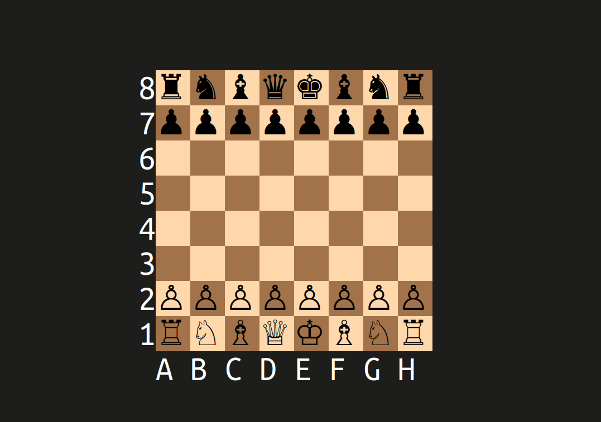
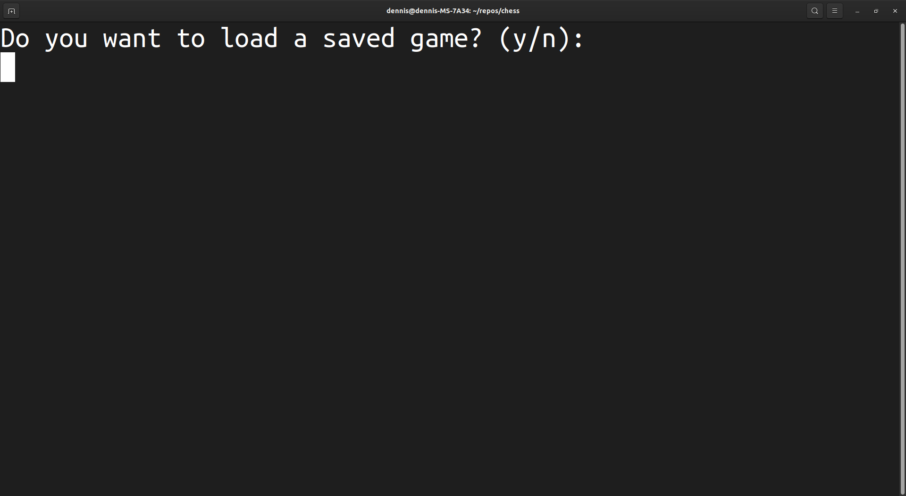
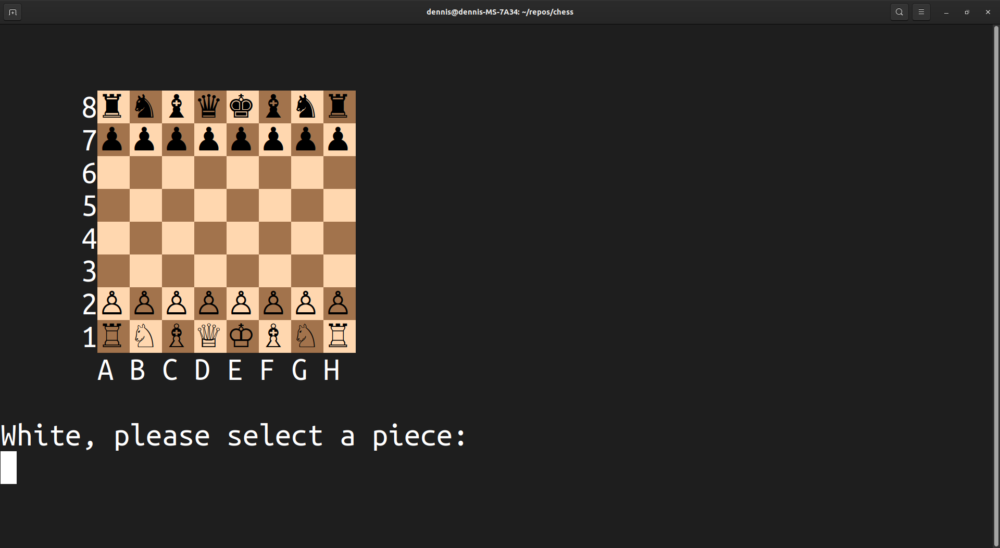
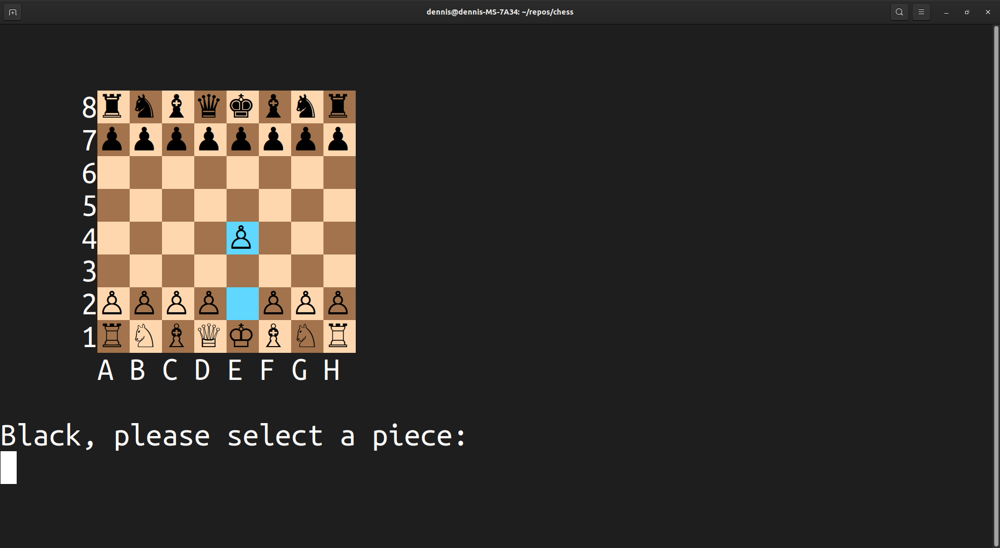
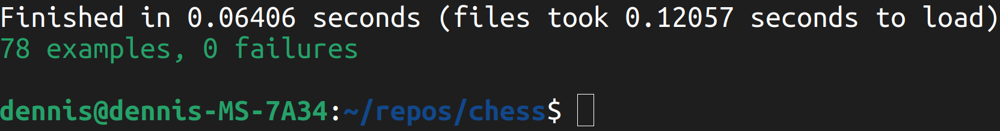

# Chess

<p align = 'center'>
  
</p>

##### <p align ='center'>A variation of the shortest possible stalemate<br>(https://www.chess.com/forum/view/game-showcase/the-shortest-stalemate)</p>

---

## Description

This is a game of chess that can be played on the command line by two human players. It is my submission for the [Ruby course's final project](https://www.theodinproject.com/lessons/ruby-ruby-final-project) in [The Odin Project](https://www.theodinproject.com/)(TOP)'s curriculum.

As a capstone project, its development incorporates a large portion of the concepts that I have encountered while learning the language. It also showcases (or at least I hope it does!) some additional skills that I picked up since the beginning of this undertaking.

---

## Table of Contents

- [Installation](#installation)
- [Usage](#usage)
- [Features](#features)
- [Tests](#features)
- [Reflections](#reflections)

---

## Installation

There are a couple of ways to run the software:

  1. The first way is to visit the [online live preview](https://replit.com/@royojeda/chess). Once there, simply click the 'Play' icon, or the 'Run' button.

  2. The other option is to clone the GitHub repository to your own Linux computer by running the following command in the command line (you must have git installed):

      ```git
      git clone git@github.com:royojeda/chess.git
      ```
     and then run:
      ```bash
      cd chess
      ```
     to enter the project directory, and finally, run:
      ```
      ruby lib/main.rb
      ```
     to get the application running.

The live preview method is easier, but the local clone method has better performance (i.e., less stuttering).

---

## Usage
### Loading a save file
As you run the application, there will be a prompt to decide whether or not to load a saved game.



A save file is included in the repository, but you can also save your game at the start of every turn for later continuation.

If unsure, simply enter `n` to start a new game.<br><br>

### Turns
As with any standard game of chess, White moves first.

The current player is now asked for a location of the piece that they want to move.



The possible move/s for that piece is/are highlighted, and a second prompt asks for a location to which the player wants to move the selected piece.


Finally, the move is executed and the other player begins their turn.



The locations are expected to be entered in [Algebraic Notation](https://en.wikipedia.org/wiki/Algebraic_notation_(chess)).<br><br>

### Saving the game
Instead of selecting a piece, the player can also enter 'save' at the start of every turn and the current game conditions will be saved to a save file which can be continued later on, as described earlier.

---

## Features

Aside from those shown above, here are some other things that the application can handle:
 - [Castling](https://en.wikipedia.org/wiki/Castling).
 - [En passant](https://en.wikipedia.org/wiki/En_passant).
 - [Promotion](https://en.wikipedia.org/wiki/Promotion_(chess)).
 - User error (with specific error messages for each situation)

   1. Player input is not in a valid format.
   1. Player selects an empty square when asked for a piece to move.
   1. Player tries to move an opponent's piece.
   1. Player tries to move a selected piece to an invalid destination.

      1. The selected piece doesn't support moving to the destination.

      1. The destination contains an allied piece, and/or, for pawns, an enemy piece.

      1. The destination is behind an enemy piece.

      1. For pawns, capture move doesn't have a valid capturable piece.

      1. For pawns, invalid en passant conditons.

      1. For kings, invalid castling conditions.

      1. Moving to the destination doesn't remove a check.

      1. Moving to the destination results in a check.

  - [Checkmate](https://en.wikipedia.org/wiki/Checkmate) (with an announcement of the winner).
  - [Stalemate](https://en.wikipedia.org/wiki/Stalemate)
  - Highlighting of opponent's previous move.
  - Refreshing of the display every time the board changes (i.e., not flooding the command line with multiple boards appearing beneath the last).

## Tests

This application is not developed in a test-first manner. Still, I wrote several tests for many of the methods that I might refactor later on as I gain more experience with design patterns and encounter better ways to solve recurring problems.

The tests are written in RSpec. Run them by executing the command: `rspec` in the command line.



---

## Reflections
I think this project is the most challenging piece of software that I have had to make that is not a hypothetical solution to a hypothetical problem. My programming experience prior to TOP was almost always alongside some form of hardware work, which means that the focus is split between two different components of the task.

In terms of the sheer scope of making pure software, this is probably my best work at the time of writing, and it's not even perfect, nor something that I am a hundred percent satisfied with.

However, it is at the point where any further improvements would not be worthwhile to me. The project specifications are all met, with even several additional features that I personally consider essential to my implementation.

In conclusion, I believe that this is a project that's worth doing and finishing for anyone who wants to assess their skills in programming; in my case, with Ruby and the concepts in object-oriented design.
